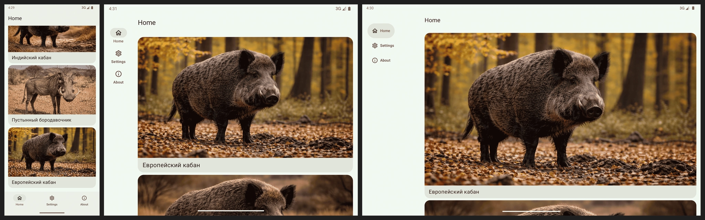

# NavigationSuiteScaffold

A collection of Android samples demonstrating how to implement adaptive navigation using `NavigationSuiteScaffold` from Jetpack Compose Material 3.

    

## Samples

| #  | Sample                                 | Description                                                        |
|----|----------------------------------------|--------------------------------------------------------------------|
| 01 | Classic Scaffold BottomBar             | Traditional bottom navigation using `Scaffold` with `BottomAppBar` |
| 02 | NavigationSuiteScaffold NavigationBar  | Bottom navigation bar via `NavigationSuiteScaffold`                |
| 03 | NavigationSuiteScaffold NavigationRail | Side navigation rail for larger screens                            |
| 04 | NavigationRail NoLabels                | Navigation rail without text labels                                |
| 05 | NavigationRail Expanded                | Expanded navigation rail layout                                    |
| 06 | NavigationRail VerticalArrangement     | Navigation rail with custom vertical arrangement                   |
| 07 | NavigationRail Expanded State          | Expanded rail with persistent state                                |
| 08 | PrimaryActionContent                   | Navigation rail with a primary action (FAB-like) slot              |
| 09 | Colors                                 | Custom color theming for navigation components                     |
| 10 | NavigationSuite                        | Low-level `NavigationSuite` composable usage                       |
| 11 | NavigationSuiteScaffoldLayout          | Manual layout control with `NavigationSuiteScaffoldLayout`         |
